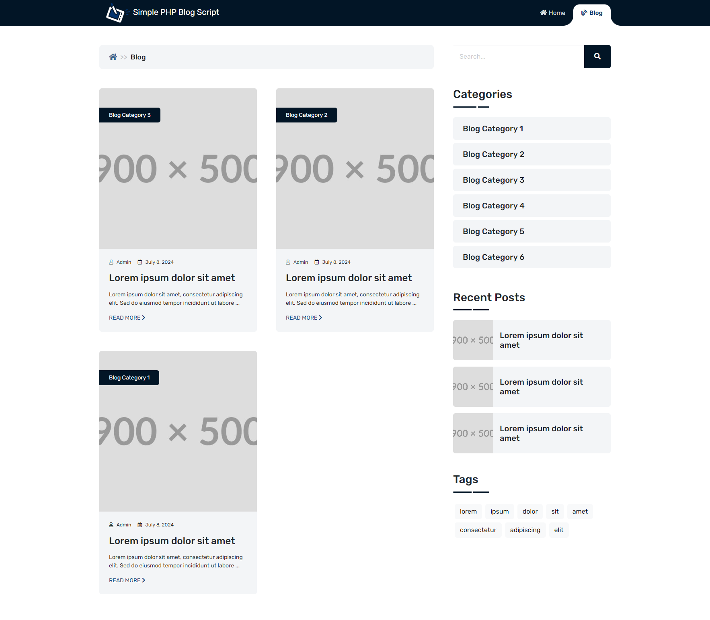

# Simple PHP Blog Script

The Simple PHP Blog Script is a lightweight blogging platform built using PHP. It is designed to be easy to use and configure, providing basic blogging functionalities without the need for a database. It uses jQuery and Bootstrap for enhanced functionality and responsive design. This script is optimized for SEO to help improve the visibility of your blog posts.

## Features

-  **Filter by Category**
-  **Filter by Tag**
-  **Filter by Search**
-  **Pagination**
-  **Responsive Design**
-  **Easy Configuration**
-  **SEO Optimized**
-  **No Database Required**

## Libraries Used

-  **jQuery**: For dynamic content handling and interactions.
-  **Bootstrap**: For responsive and modern UI components.

## Technologies

-  **PHP**: Server-side scripting language used to handle blog content.
-  **SEO Optimization**: Features designed to improve search engine rankings and visibility.

## Installation

1. **Clone or download the repository:**

   ```bash
   git clone https://github.com/Turbo0x03/simple-php-blog-script.git
   ```

2. **Upload the script to your server or local environment.**
3. **Configure the settings**

   Open `config.php` and adjust the following constants:

   ```php
   define('SITE_NAME', 'Your Site Name');
   define('BASE_TITLE', 'Your Base Title');
   define('SITE_DESCRIPTION', 'Your Site Description');
   define('SITE_URL', 'https://yourwebsite.com');
   ```

4. **Create your blog posts**

   -  Add your blog posts in the `posts` directory.
   -  To ensure SEO optimization, format your META tags in the HTML files as follows:

      ```
      <!--META
      title: Your Post Title
      description: A brief description of the post
      keywords: comma, separated, keywords
      image: path-to-image.jpg
      category: Your Category
      tags: comma, separated, tags
      date: YYYY-MM-DD
      author: Your Name
      -->

      <!-- Your blog content here -->

      ```

5. **Access your blog**

   Open your browser and navigate to the URL where you uploaded the script to start using your blog.

## Important Note

This script is designed to work with Apache servers. It may not function correctly with other web servers like Nginx without additional configuration.

## Screenshots

### Web Version





### Mobile Version


## Contributing

Feel free to open issues or submit pull requests to improve the script. Contributions are welcome!

## License

This project is licensed under the MIT License. See the [LICENSE](LICENSE) file for details.
